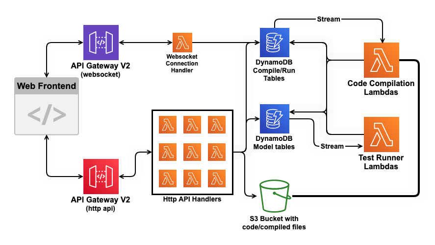

# dontstress
Stupidly fast, completely serverless and infinitely scalable stress tester. Don't stress over your failing competitive programming task solution, let dontstress stress it for you.

## Motivation
As students during school, university, rest of life it sometimes gets increasingly annoying to debug your solution to a task (you forgot about some edge case, written a minus instead of a plus somewhere, etc), which is exactly the problem this stress tester fixes! Deploy it for yourself and your friends or classmates and make your lives infinitely simpler.  

But how is this different from existing platforms like PCMS, Ejudge, Codeforces, and the rest of them, you might ask? Well, this tester runs on a completely serverless architecture (Amazon AWS), and is designed in such a way which allows it to be as scalable as you want it to be and incredibly fast.

## Architecture
During development, we have switched up our architecture multiple times when we realised how we could improve it. Having gone through various serverless API + Docker-based designs, we ended up with a fully serverless architecture, allowing the stresser to be quite competitive with the existing ones.

### Stack
- Amazon AWS (API Gateway V2, S3, DynamoDB, Lambda)
- Serverless Framework
- AngularJS (Frontend - WIP)
- Golang+Fiber for lambda-based API
- Typescript (serverless-go plugin)
- Javascript (library for lambda defs with proper IAM roles)

### Architecture Graph


### Design
- All API calls are handled by AWS API Gateway which routes requests to specified Lambdas which were optimized for cold+hot start
- DynamoDB streams are used in order to launch compilation and execution tasks instead of invokes from other lambdas and polling
- AWS Websocket is used to save lambda execution time and simply send response to client once compilation/execution is finished, avoiding polling
- Code compilation is routed to lambdas with different layers containing the packaged and minified compilers/interpreters
- Test execution is ran completely concurrently by many asynchronously launched lambdas, each of which runs 3 executables (test generator, test validator and user solution) in parallel to save resources and time

All of these design choices make up an architecture which doesn't require any work to scale, since all API calls are handled by AWS and any code compilation/execution is ran in parallel, using up less time and resources than it would on a normal server-based architecture. What this actually means is that no matter the test or user count, stress tests will always complete in the same time.

### Costs
Since everything runs on AWS and the whole compilation/execution flow is optimized, running this with your Amazon AWS account will use near-to-zero finances! DynamoDB and S3 manipulations are minimal, and lambda execution time for test runs is in the range of 5-10 seconds (which, multiplied by the limit of less than 1GB memory, results in nearly zero usage of GB-seconds).  

## Deployment
**Currently guide is WIP since proper release has been delayed not one but three times due to architectural changes**
1. Get yourself an Amazon AWS account
2. Create an IAM role to use for serverless framework and set it up locally in ~/.aws/credentials under the profile "dontstress"
3. Clone this repository
4. Install all dependencies by running
```bash
npm install
```
5. Deploy the actual stresser!
```bash
npx sls deploy
```
6. Serverless framework will output the created endpoint which you can simply open up and use the stresser

## Usage
1. At the end of deployment, you should receive the first admin token in the output. If you will ever require more admin tokens (for others to create tasks and deploy stressers), you can do so in the admin menu
2. Create labs and then tasks in those labs 
3. Deploy written stress testers and validators (simply a valid solution to the task)
4. Spread the link between to the people you would want to use the tester!
5. To test a solution, simply select the wanted task, insert your code and click the button to launch tests
